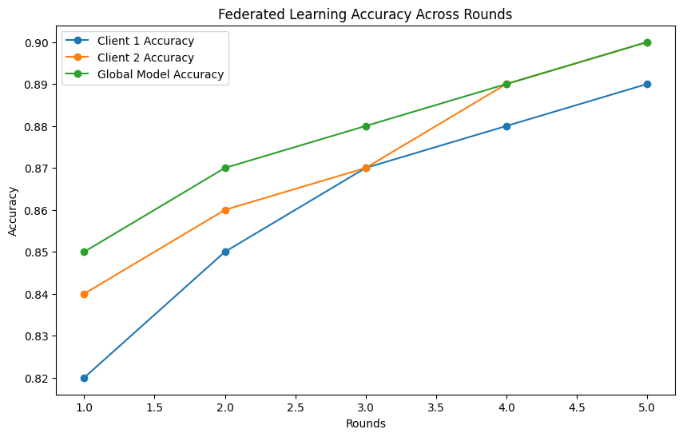
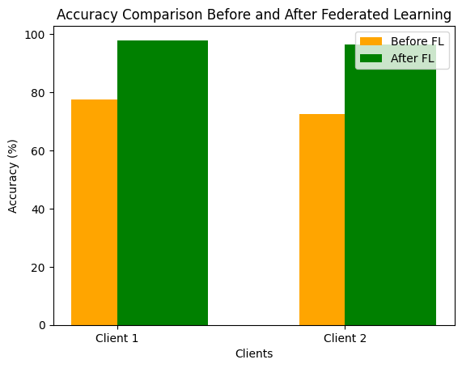

# Federated Learning on MNIST – bridging accuracy gaps across noisy and clean clients

Federated Learning (FL) enables multiple clients to collaboratively train a model **without sharing raw data**, ensuring privacy and efficiency.  
This project demonstrates **how FL improves model performance for clients with different data qualities** using the MNIST dataset.  

---
## 🚀 Project Overview  
- **Client 1:** Trains on standard MNIST data (clean, high-quality).  
- **Client 2:** Trains on noisy MNIST data (simulating real-world harder cases).  
- **Challenge:** Client 2’s accuracy is lower due to noisy data.  
- **Solution:** Apply **Federated Averaging (FedAvg)** to merge client models and train collaboratively.  

---
## 📊 Results  

| Client | Accuracy Before FL | Accuracy After FL |
|--------|--------------------|-------------------|
| Client 1 (clean MNIST) | ~77.5% | **97.9%** |
| Client 2 (noisy MNIST) | ~72.5% | **96.3%** |


 **Federated Learning successfully bridges the performance gap** between clean and noisy data clients.
 
---
## ✅ Insights
 

 
 
---
## 📂 Dataset  
- **MNIST Handwritten Digit Dataset** (60,000 train, 10,000 test)  
- Source: [MNIST on torchvision](https://pytorch.org/vision/stable/generated/torchvision.datasets.MNIST.html)  
- **Why MNIST?**  
  - Classic benchmark for computer vision & FL research.  
  - Small, fast to train, but realistic enough to show domain shift when noise is added.  

---

## 🌍 Real-World Use Cases  
- **Healthcare:** Hospitals with different quality of MRI scans collaboratively train models without sharing sensitive data.  
- **Finance:** Banks collaboratively detect fraud while keeping customer data private.  
- **IoT & Edge Devices:** Smartphones collaboratively improve predictive keyboards without sending personal text data to the cloud.  

---

🧠 **Model Architecture**
- Simple Neural Network (fully connected):
- Input: 28×28 flattened image
- Hidden Layer: 128 neurons (ReLU)
- Output: 10 classes (digits 0–9)

---
📈 **Key Learning Outcomes**
- Understand data heterogeneity problem in Federated Learning.
- Implement Federated Averaging (FedAvg).
- Demonstrate how collaborative training boosts generalization across clients.
- For clear explanation, read my [blog on medium](https://medium.com/@shreyavj.05/how-federated-learning-solves-the-accuracy-gap-in-heterogeneous-data-8739470447e0)
---
## 🛠️ Installation & Usage  

###**To install & use this repo **
```bash
# Step-1: to clone the repo
git clone https://github.com/ShreyaVijaykumar/federated-mnist.git
cd federated-mnist

# Step-2: Create Virtual Environment & Install Dependencies
python -m venv venv
source venv/bin/activate  # On Windows: venv\Scripts\activate
pip install -r requirements.txt

# Step-3: Run the Training
python federated_mnist.py
